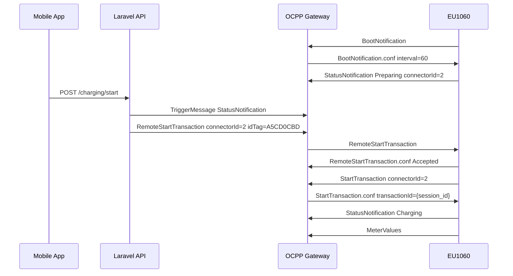
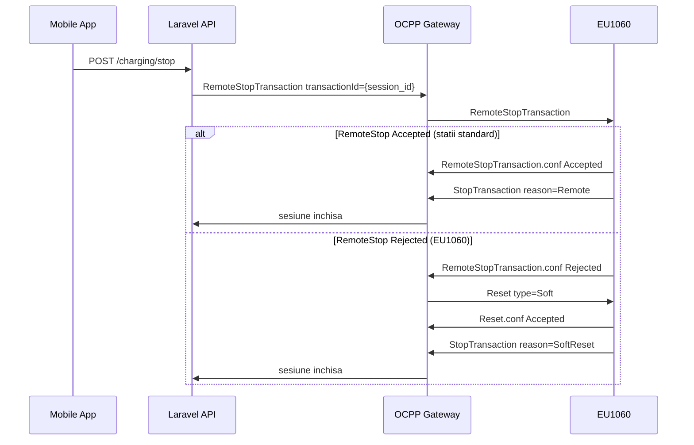

# Volta EV OCPP setup

Proiectul ruleaza implicit in modul **gateway** pentru statii reale OCPP 1.6J.

Referinte standard: [OCPP 1.6J overview](https://ocpp.md/ocpp-1.6j/), [fluxuri Core](https://ocpp.md/ocpp-1.6j/sequences/), [OCPP 1.6 PDF](https://downloads.regulations.gov/FHWA-2022-0008-0403/attachment_6.pdf).

## Runtime pieces

- Backoffice (si clientii API) apeleaza Laravel (`:8000`).
- Statia fizica se conecteaza la gateway-ul OCPP WebSocket (`:9000`).
- Gateway-ul actualizeaza `stations`, `charging_sessions`, `ocpp_messages` si `ocpp_commands`.

## Pornire locala (test cu statie reala)

Terminal 1 — API:

```bash
cd backend
php artisan serve --host=0.0.0.0 --port=8000
```

Terminal 2 — Gateway OCPP:

```bash
cd backend
php artisan ocpp:serve --host=0.0.0.0 --port=9000
```

Terminal 3 — Backoffice (optional):

```bash
cd backoffice
npm run dev
```

## Environment (`backend/.env`)

```dotenv
OCPP_MODE=gateway
OCPP_HOST=0.0.0.0
OCPP_PORT=9000
OCPP_PUBLIC_URL=ws://192.168.1.42:9000/ocpp
OCPP_HEARTBEAT_INTERVAL=60
OCPP_COMMAND_POLL_INTERVAL_MS=250
OCPP_COMMAND_BATCH_SIZE=6
OCPP_REFRESH_STATUS_SECONDS=3
OCPP_REFRESH_TELEMETRY_SECONDS=5
OCPP_METER_VALUE_SAMPLE_INTERVAL=5
OCPP_START_SYNC_WAIT_MS=1200
OCPP_START_SYNC_WAIT_CONNECTED_MS=400
OCPP_SOFT_RESET_ON_STOP_REJECT=true
```

| Variabila | Rol |
|-----------|-----|
| `OCPP_MODE` | `gateway` (statie reala) sau `simulator` (demo fara hardware) |
| `OCPP_PUBLIC_URL` | URL afisat in backoffice; inlocuieste IP-ul LAN |
| `OCPP_HEARTBEAT_INTERVAL` | Interval returnat in `BootNotification.conf` |
| `OCPP_METER_VALUE_SAMPLE_INTERVAL` | Interval push la statie + scheduler telemetry |
| `OCPP_SOFT_RESET_ON_STOP_REJECT` | Dupa `RemoteStop Rejected`, trimite `Reset Soft` (EU1060) |

Pentru demo fara hardware: `OCPP_MODE=simulator`.

## QR code de pe statia fizica

Statia afiseaza propriul QR (serial hardware, ex. `419400481F59D7`, uneori cu conector `B`).

In backoffice → Statii → editeaza statia:

| Camp | Valoare |
|------|---------|
| OCPP identity | acelasi serial sau ID configurat in statie |
| QR code | **serialul de pe ecran** (ex. `419400481F59D7`) |

Daca QR-ul contine conectorul B, app-ul porneste pe `connectorId=2`.

Dupa `BootNotification`, backoffice afiseaza serialul OCPP detectat — copiaza-l in campul QR code daca nu coincide.

## Configurare statie VOLTA 1

In backoffice → Statii → VOLTA 1:

| Camp | Valoare |
|------|---------|
| OCPP identity | `volta-1` (sau serialul din statie) |
| OCPP versiune | `1.6J` |
| URL conectare | `ws://{IP_LAN}:9000/ocpp/volta-1` |

In panoul statiei fizice:

- **Backend URL:** `ws://192.168.1.42:9000/ocpp/volta-1/{serial}`
- **Charge Point ID:** serial sau `volta-1`
- **Protocol:** OCPP 1.6 JSON over WebSocket
- **Subprotocol:** `ocpp1.6`
- **Heartbeat:** 60 secunde
- **TLS:** dezactivat la test local (`ws://`)

## Conformitate OCPP 1.6J — ce face gateway-ul

### Obligatii Central System (conform spec)

| Cerinta OCPP | Implementare Volta |
|--------------|-------------------|
| `BootNotification.conf` cu `currentTime`, `interval`, `status` | Da |
| `Heartbeat.conf` cu `currentTime` | Da |
| `StartTransaction.conf` **intotdeauna** (chiar la eroare → `Invalid`) | Da |
| `StopTransaction.conf` **intotdeauna** | Da |
| `transactionId` alocat de CS in `StartTransaction.conf` | Da (session id) |
| `RemoteStop` foloseste acelasi `transactionId` alocat | Da |
| Sesiune inchisa la `StopTransaction.req`, nu la `RemoteStop Rejected` | Da |
| `StatusNotification` cu `connectorId=0` acceptat | Da (heartbeat de conexiune) |
| Actiuni necunoscute → `CallError NotImplemented` | Da |
| `ChangeAvailability Scheduled` tratat ca succes | Da |
| Prioritate comenzi: Start/Stop/Reset inainte de TriggerMessage | Da |

### Mesaje suportate

**Inbound (statie → server):**

- `BootNotification`, `Heartbeat`, `StatusNotification`
- `Authorize`, `StartTransaction`, `MeterValues`, `StopTransaction`
- `GetConfiguration`, `ChangeConfiguration`, `DataTransfer`

**Outbound (server → statie):**

- `RemoteStartTransaction`, `RemoteStopTransaction`
- `TriggerMessage`, `ChangeConfiguration`, `Reset`

**Nu implementate (profil optional):** `ClearCache`, `UnlockConnector`, `ReserveNow`, Smart Charging, Firmware Update.

## Analiza hardware — VOLTA EU1060 (dual A/B)

### Pornire



### Oprire (conform OCPP + workaround EU1060)



### Status implementare

| Layer | Status | Note |
|-------|--------|------|
| WebSocket + subprotocol `ocpp1.6` | OK | |
| BootNotification / Heartbeat | OK | |
| StatusNotification per conector (1=A, 2=B) | OK | |
| Authorize + StartTransaction | OK | Tag local + sesiune app pending |
| MeterValues + StopTransaction | OK | kWh din `meterStop` Wh |
| RemoteStartTransaction | OK | idTag local per conector |
| RemoteStopTransaction | Partial | Respins pe EU1060 → fallback Reset Soft |
| TriggerMessage | OK | Refresh status + MeterValues |
| GetConfiguration / ChangeConfiguration | OK | Minimal Core profile |
| Reset Soft (oprire fortata) | OK | `ocpp:force-stop` sau auto dupa Rejected |
| Detectare conector A/B | OK | Preparing, SuspendedEV |

### Probleme gasite in testele reale (EU1060)

1. **RemoteStart pe conectorul gresit** — verifica `connectorId` in payload (B = 2).
2. **idTag gresit** — necesita tag RFID local (`A5CD0CBD` pe B), nu `VOLTA...`.
3. **StatusNotification nu vine la plug** — necesita `TriggerMessage` dupa BootNotification.
4. **BootNotification** — config conectori/tags se pastreaza (merge, nu replace).
5. **`transactionId: 0` in MeterValues** — quirk firmware; **nu** il folosim pentru `RemoteStop` (spec: foloseste ID din `StartTransaction.conf`).
6. **`RemoteStopTransaction` respins** — workaround: `Reset Soft` (OCPP 5.14).

### Flux corect EU1060 dual-port

1. Conecteaza cablul la **A sau B**.
2. Apasa **Pornire** (API: `TriggerMessage` + `RemoteStart` cu conector + idTag corect).
3. Confirma `StartTransaction` + `Charging` in loguri.
4. La oprire: `RemoteStop` → (daca Rejected) `Reset Soft` → `StopTransaction`.

### Loguri `ocpp:serve`

```
OCPP inbound ... <- StatusNotification: {"connectorId":2,"status":"Preparing"}
OCPP outbound ... -> RemoteStartTransaction: {"connectorId":2,"idTag":"A5CD0CBD"}
OCPP result ... <- RemoteStartTransaction: {"status":"Accepted"}
OCPP inbound ... <- StartTransaction: {"connectorId":2,"idTag":"A5CD0CBD"}
OCPP inbound ... <- StatusNotification: {"connectorId":2,"status":"Charging"}
OCPP inbound ... <- MeterValues: {...}
OCPP outbound ... -> RemoteStopTransaction: {"transactionId":16}
OCPP inbound ... <- StopTransaction: {"reason":"SoftReset","transactionId":0}
```

## Flux aplicatie

1. Statia se conecteaza → `connected` in backoffice/API.
2. User scaneaza QR → **Pornire** → `RemoteStartTransaction`.
3. `MeterValues` la ~5s → kWh, kW, A, V in app.
4. **Oprire** → `RemoteStopTransaction` → asteapta `StopTransaction`.
5. Factura din `meter_start_kwh` / `meter_stop_kwh`.

### Reguli transactionId

| Unde | Valoare corecta |
|------|-----------------|
| `StartTransaction.conf` | Session id (alocat de gateway) |
| `RemoteStopTransaction` | Acelasi session id |
| `StopTransaction` de la statie | Poate fi `0` pe EU1060 — OK |
| `MeterValues.transactionId` | Informativ; EU1060 trimite `0` |

### Comenzi artisan

```bash
# Oprire fortata (RemoteStop + ChangeAvailability + Reset Soft)
php artisan ocpp:force-stop 5D419400481F59D750010067 --connector=2
```

## Detectare conector A / B

| Fizic | connectorId | Label app |
|-------|-------------|-----------|
| A | 1 | A |
| B | 2 | B |

`live_status`: `connected_connector_id`, `connected_connector_label`.

## Troubleshooting

### Sesiune in app dar nu incarca

1. `ocpp_commands`: `RemoteStartTransaction` = `accepted`.
2. `connectorId` corect (B = 2).
3. idTag local invatat automat din mesajele statiei.
4. Asteapta `Finishing` → `Available` inainte de repornire pe acelasi conector.
5. Reporneste gateway dupa update cod.

### Oprire esuata / statia continua

1. Verifica `RemoteStopTransaction` in `ocpp_commands` — daca `rejected`, urmeaza `Reset` Soft.
2. Confirma `StopTransaction` in loguri inainte de sesiune inchisa in DB.
3. `OCPP_SOFT_RESET_ON_STOP_REJECT=true` in `.env`.
4. Comanda urgenta: `php artisan ocpp:force-stop {identity} --connector=2`.

### Statia apare Deconectata in app

- Verifica `last_ocpp_message_at` — gateway-ul foloseste grace period (~90s).
- Reporneste `ocpp:serve` dupa reconnect-uri.

## Checklist acceptanta hardware

1. URL OCPP configurat in statie + backoffice.
2. `BootNotification` in terminal.
3. Heartbeat la interval configurat.
4. Plug → `StatusNotification` Preparing/Charging.
5. Pornire app → `RemoteStart` accepted → `StartTransaction`.
6. `MeterValues` → `kwh_consumed` creste.
7. Oprire app → `RemoteStop` → `StopTransaction` (Remote sau SoftReset).
8. Factura cu kWh din contor.

## Productie

```text
wss://ocpp.volta.md/ocpp/{ocpp_identity}
```

Ruleaza `php artisan ocpp:serve` sub Supervisor/systemd. TLS obligatoriu in productie.
